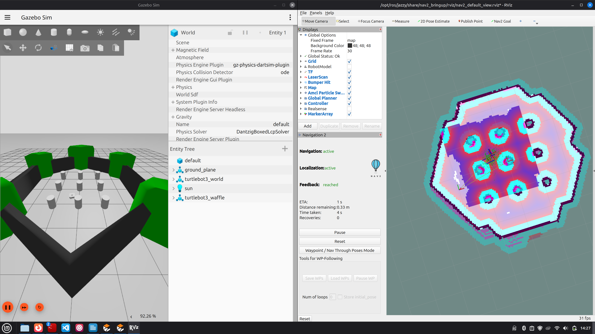
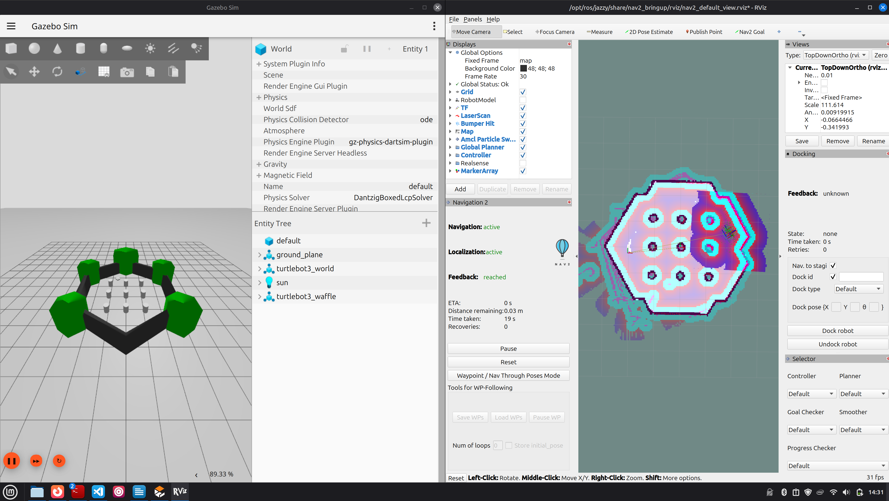
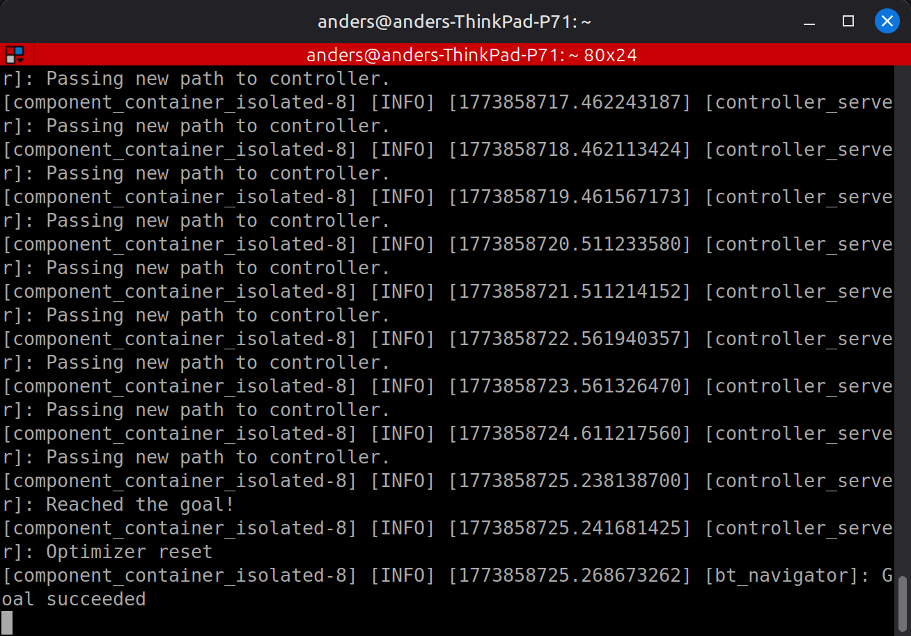
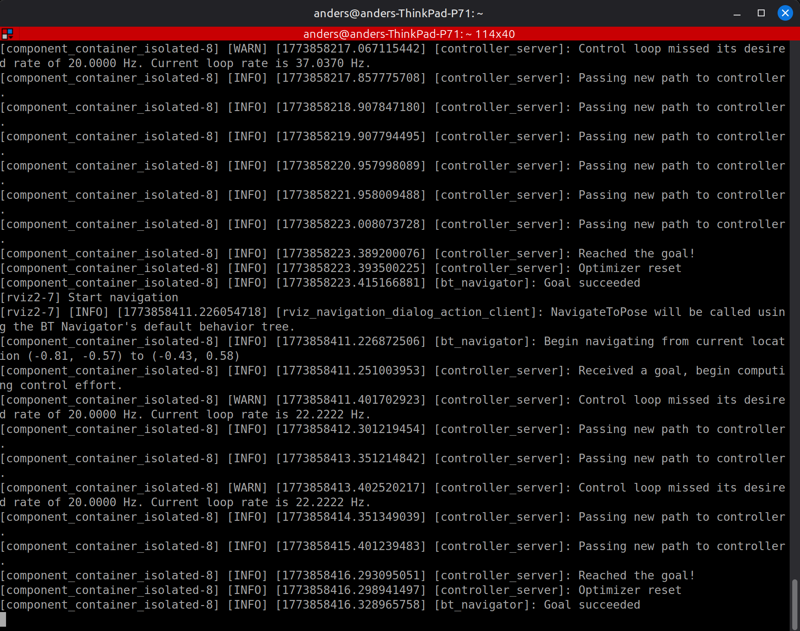
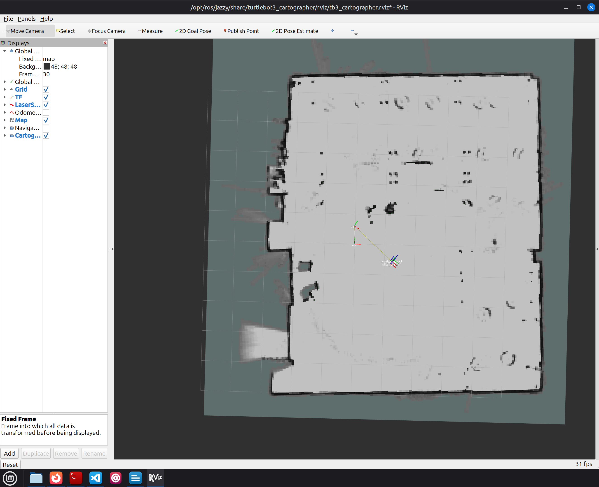
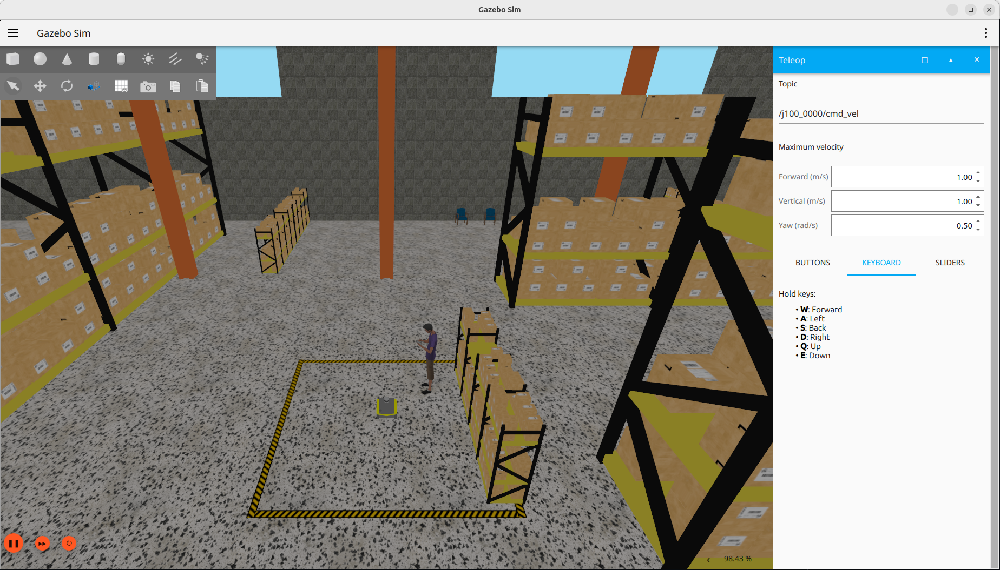
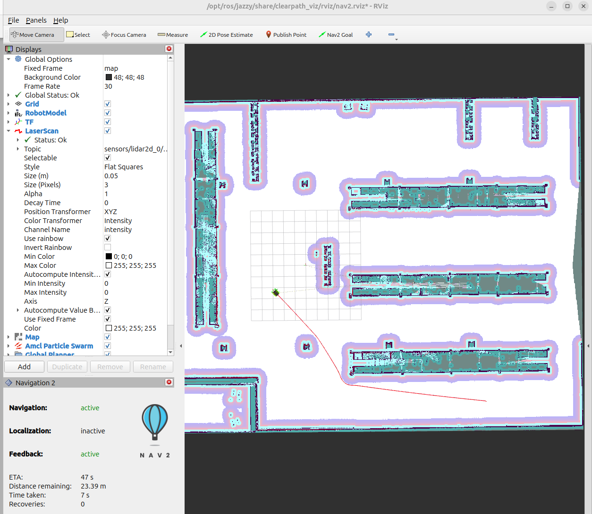
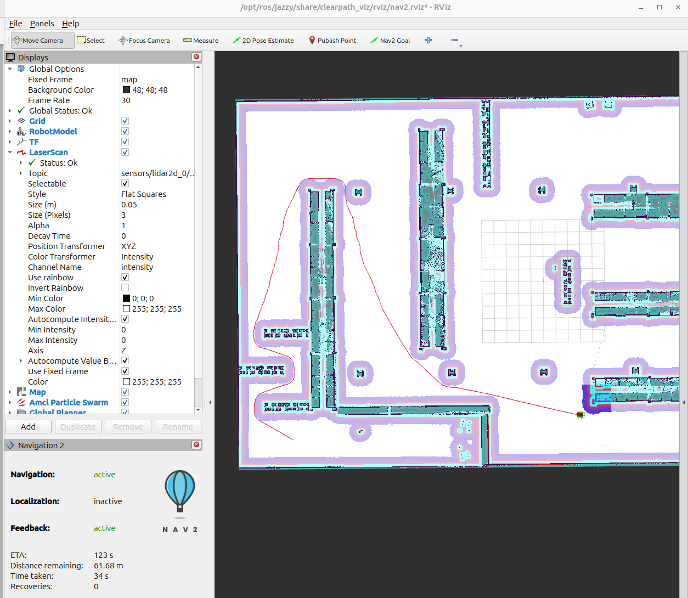
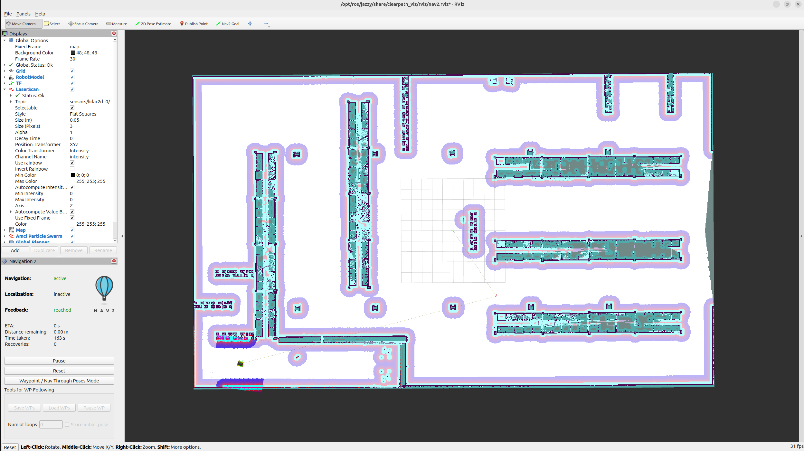

## Assignment Implementation: EE5531 Project 7
**Authors:** Anders Smitterberg, Jackson Newell

---

### Introduction and Setup

- **ROS2 Distribution:** Jazzy
- **OS:** Ubuntu 24.04

There were no real issues encountered when setting up the simulations other than ensuring all of the clearpath and turtlebot dependancies were resolved, including the gazebo packages. Following the documentation resolved any issues we encountered.

---

### Part 1 — TurtleBot3 Simulation with Nav2

**TurtleBot3 in the Gazebo simulation environment**


**RViz2 view of the TurtleBot3**


**Navigation goal set with planned path visible**


**Robot navigating to the goal**


**Robot successfully reached the goal**


**Terminal output confirming goal reached**


The Nav2 package performed very well, it appeared to pretty easily localize and navigate between goals. As it improved its localization and discovered more of the map the path planning improved on the fly.

---

### Part 2 — Real-World SLAM Mapping of EERC 722

**Completed SLAM map of EERC 722**


The saved map files are committed to the repository:
- [`maps/eerc722.pgm`](maps/eerc722.pgm)
- [`maps/eerc722.yaml`](maps/eerc722.yaml)

**Screen recordings of the mapping and driving around:**


**Video of the real-world navigation:**


We selected points near objects that could be easily navigated to with a waypoint always in view. The robot was able to navigate in the real world with little issue, but sometimes seemed to take a while to finalize it's orientation.

---

### Part 3 — Jackal Simulation

Below are the screenshots obtained for the Jackal simulation.

**Gazebo Simulation Screenshot of the Jackal in the Warehouse Environment**


**Jackal Navigating to the first set Waypoint**


**Jackal Navigating to the second set Waypoint**


**Image of the Entire Generated Map in Rviz2**


The differences between the setup of the Jackal and Turtlebot3 were how to configure the simulations. The turtlebot3 has a preset configuration that needs to be declared for the 'burger' model. This is a parameter that needs to be set in the terminal. The Jackal on the other hand has a 'robot.yaml' that describes the links, sensors, and other features on the Jackal robot. The model 'J100' is a preset model which is the Jackal model, but the Jackals can have plenty of different sensors mounted onto it. Therefore, this 'robot.yaml' file declares and describes how and where the sensors are mounted. Another difference was needing to set a parameter while saving the map. The parameter was just setting the topic to save the map from. That command is in the Clearpath documentation and it is below. The documentation is for the A300 model so the command is slightly altered for the J100 namespace. In addition, the save location is also changed.

```
ros2 run nav2_map_server map_saver_cli -f "map_jackal_sim/map_jackal" --ros-args -p map_subscribe_transient_local:=true -r __ns:=/j100_0000
```

The Jackal map files are committed to the repository:
- [`maps/map_jackal_sim.pgm`](maps/map_jackal_sim.pgm)
- [`maps/map_jackal_sim.yaml`](maps/map_jackal_sim.yaml)

---

### Usage Instructions

#### Prerequisites

This repository uses [Git LFS](https://git-lfs.com) to store large files. Install it before cloning:

```bash
# Ubuntu/Debian
sudo apt install git-lfs
git lfs install
```

#### Clone and Build

This repository is the `src/` directory of a colcon workspace. Set it up like this:

```bash
mkdir -p proj7_ws
cd proj7_ws
git clone https://github.com/Robust-Autonomous-Systems-Laboratory/proj7_group3 src
source /opt/ros/jazzy/setup.bash
colcon build
```

#### Terminal Setup (every new terminal)

```bash
source /opt/ros/jazzy/setup.bash
source src/turtlebot_connect.sh
source install/setup.bash
```

`turtlebot_connect.sh` sets `TURTLEBOT3_MODEL=burger`, `RMW_IMPLEMENTATION=rmw_fastrtps_cpp`, and `ROS_DOMAIN_ID=8`.

---

#### Part 1 — TurtleBot3 Simulation

**Terminal 1 — Launch Gazebo simulation:**
```bash
ros2 launch turtlebot3_gazebo turtlebot3_world.launch.py
```

**Terminal 2 — Launch Nav2 with the simulation map:**
```bash
ros2 launch turtlebot3_navigation2 navigation2.launch.py \
  use_sim_time:=True \
  map:=$(ros2 pkg prefix turtlebot3_navigation2)/share/turtlebot3_navigation2/map/map.yaml
```

Once both are running, open RViz2, set the **2D Pose Estimate** to initialize AMCL, then use the **Nav2 Goal** tool to send navigation goals.

---

#### Part 2 — Real-World SLAM and Navigation in EERC 722

**On the TurtleBot3 (SSH):**
```bash
source /opt/ros/jazzy/setup.bash
source turtlebot_connect.sh
ros2 launch turtlebot3_bringup robot.launch.py
```

**Terminal 1 — Launch cartographer SLAM on your workstation:**
```bash
ros2 launch turtlebot3_cartographer cartographer.launch.py use_sim_time:=False
```

**Terminal 2 — Teleoperate the robot to build the map:**
```bash
ros2 run turtlebot3_teleop teleop_keyboard
```

Drive slowly around the perimeter of EERC 722. Once the map looks complete in RViz2, save it:

**Save the map:**
```bash
ros2 run nav2_map_server map_saver_cli -f src/maps/eerc722
```

**Terminal 1 — Launch Nav2 with the saved map for point-to-point navigation:**
```bash
ros2 launch turtlebot3_navigation2 navigation2.launch.py \
  use_sim_time:=False \
  map:=src/maps/eerc722.yaml
```

Use the **Nav2 Goal** tool in RViz2 to send navigation goals in the room.

---

#### Part 3 — Jackal Simulation

Follow the [Clearpath navigation demo tutorial](https://docs.clearpathrobotics.com/docs/ros/tutorials/navigation_demos/overview) to launch the Jackal simulation and its Nav2 stack.

**Save the Jackal map** (note the J100 namespace):
```bash
ros2 run nav2_map_server map_saver_cli -f src/maps/map_jackal_sim \
  --ros-args -p map_subscribe_transient_local:=true -r __ns:=/j100_0000
```

---

### AI Acknowledgements

Anders Smitterberg acknowledges the use of ganerative artificial intelligence in this project in the following areas:

| Section | Tool | Use | Verification |
|---------|------|-----|--------------|
| README structure and formatting | Claude | Prompted to generate section templates, usage instructions, and markdown formatting consistent with Project 6 style | Reviewed all content for accuracy against Dr Bos' README; all commands verified against official Nav2 and TurtleBot3 documentation |
